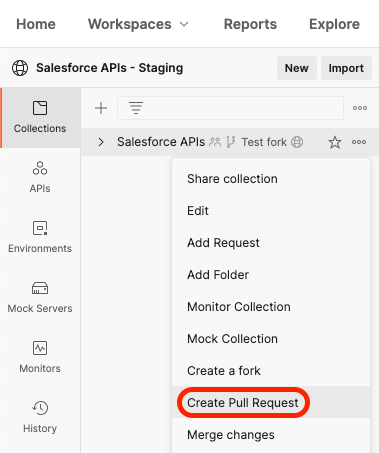

[Back to main page](README.md)

# Contributing

- [About](#about)
- [Requirements](#requirements)
- [Contribution Guidelines](#contribution-guidelines)
- [Create a Public Team](#create-a-public-team)
- [Create a Public Workspace](#create-a-public-workspace)
- [Move your Collection to your Public Workplace](#move-your-collection-to-your-public-workplace)
- [Create a Pull Request](#create-a-pull-request)

## About

We’re adding new API requests to the collection over time, but you’re welcome to help. The ability to receive community contributions is a guiding principle for the Salesforce APIs collection.

With **Public Workspaces**, you’ll find the same contribution flow that you’re already familiar with in git: forks, pull requests and pulls.

This is also great news for you even if you do not contribute to the collection because you’ll be able to pull changes from the collection (bug fixes, new APIs...) without having to reimport anything.

## Requirements

In order to contribute to the collection, you need to:
- create a public team.
- create a Public Workspace.
- move your fork of the collection to your Public Workspace.

All of this can be done with a Postman free plan.

>⚠️ Warning: you cannot contribute if you install the collection without forking it (legacy installation option and API Network installation)

## Contribution Guidelines

Follow these guidelines when contributing to the collection:

- Stage only what is relevant to what you've done.
- Never include credentials.
- Use the API documented names.
- Add description from the documentation in the Postman descriptions.
- Provide the description from the documentation for each GET parameters.
- API calls should work and be parametrized using environment variables:
  - Authentication API endpoints must use `{{url}}{{site}}` as host.
  - Other API endpoints must use `{{_endpoint}}` as host.
- Optional: provide examples.

## Create a Public Team

1. Using a browser, [sign up/in to Postman](https://identity.getpostman.com/login)
1. Open the top-right dropdown and click **Manage Team**
1. Click **Team Settings**
1. Enable **Make team profile public**
1. Click **Save Changes**

## Create a Public Workspace

1. Open the **Workspaces** menu and click **New Workspace**
1. Fill in a name for your workspace
1. Select **Team** as the visibility
1. Click **Create Workspace**
1. Under the **Sharing** section, change the Team workspace’s visibility to **Public**

    

1. Click **Save Changes**

## Move your Collection to your Public Workplace

1. Move your mouse over your “Salesforce APIs” forked collection, click on the “three dots” icon next to it and select **Share collection** from the menu.
1. Select your newly created public workspace from the list.
1. Click **Share and Continue**.
1. Click **Close**.

Use the **Workspace** menu to navigate to your public workspace and find your collection.

## Create a Pull Request

Once you're ready to contribute, follow these steps:

1. Navigate to the workspace that holds your collection
1. Click on the “three dots” icon next to the “Salesforce APIs” collection and select **Create Pull Request** from the menu.

    

1. Open the **Changes** tab and review your changes. Make sure you've met the [contribution guidelines](#contribution-guidelines).
1. Go back to the **Overview** tab.
1. Fill in the title and description fields. Leave the reviewers list empty.
1. Click **Create Pull Request**.

[Back to main page](README.md)
