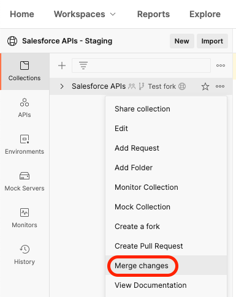

[Back to main page](README.md)

# Contributing

- [About](#about)
- [Propose Changes](#propose-changes)
    - [Requirements](#requirements)
    - [Contribution Guidelines](#contribution-guidelines)
    - [Create a Public Team](#create-a-public-team)
    - [Create a Public Workspace](#create-a-public-workspace)
    - [Fork the Collection](#fork-the-collection)
    - [Create a Pull Request](#create-a-pull-request)
- [Pull Changes](#pull-changes)

## About

We’re adding new API requests to the collection over time, but you’re welcome to help. The ability to receive community contributions is a guiding principle for the Salesforce APIs collection.

With **Public Workspaces**, you’ll find the same contribution flow that you’re already familiar with in git: forks, pull requests and pulls.

This is also great news for you even if you do not contribute to the collection because you’ll be able to pull changes from the collection (bug fixes, new APIs...) without having to reimport anything.

## Propose Changes

### Requirements

In order to contribute to the collection, you need to:
- create a public team.
- create a Public Workspace.
- fork the collection from the main Public Workspace.

All of this can be done with a Postman free plan.

>⚠️ Warning: you cannot contribute if you install the collection from the Postman API Network (default installation).

### Contribution Guidelines

Follow these guidelines when contributing to the collection:

- Stage only what is relevant to what you've done.
- Never include credentials.
- Use the API documented names.
- Add description from the documentation in the Postman descriptions.
- Provide the description from the documentation for each GET parameters.
- API calls should work and be parametrized using environment variables:
  - Authentication API endpoints must use `{{url}}{{site}}` as host.
  - Other API endpoints must use `{{_endpoint}}` as host.
- Optional: provide examples.

### Create a Public Team

1. Using a browser, [sign up/in to Postman](https://identity.getpostman.com/login)
1. Open the top-right dropdown and click **Manage Team**
1. Click **Team Settings**
1. Enable **Make team profile public**
1. Click **Save Changes**

### Create a Public Workspace

1. Open the **Workspaces** menu and click **New Workspace**
1. Fill in a name for your workspace
1. Select **Team** as the visibility
1. Click **Create Workspace**
1. Under the **Sharing** section, change the Team workspace’s visibility to **Public**

    

1. Click **Save Changes**

### Fork the Collection

1. Navigate to [this link](https://www.postman.com/salesforce-developers/workspace/salesforce-developers/collection/12721794-67cb9baa-e0da-4986-957e-88d8734647e2/fork) to create a fork of the collection
1. Enter a label for your fork (e.g.: “My fork”)
1. Select the Public Workspace you create earlier
1. Click **Fork Collection**

At this point, you can continue the regular installation procedure either [in the Web UI](install-api-network-web.md) or [in the desktop app](install-api-network-app.md). Postman synchronizes your changes between the two environments.

### Create a Pull Request

Once you're ready to contribute, follow these steps:

1. Using a browser, [sign up/in to Postman](https://identity.getpostman.com/login)
1. Navigate to the workspace that holds your collection
1. Click on the “three dots” icon next to the “Salesforce APIs” collection and select **Merge Changes** from the menu.

    

1. Open the **Changes** tab and review your changes. Make sure you've met the [contribution guidelines](#contribution-guidelines)
1. Go back to the **Overview** tab
1. Fill in the title and description fields. Leave the reviewers list empty.
1. Click **Create Pull Request**

## Pull Changes

Pulling changes requires that you work on a [fork](#fork-the-collection) of the main Public Workspace. 
Your workspace doesn't need to be public and you don't need a team to pull changes. You can use a personal private workspace.

1. Using a browser, [sign up/in to Postman](https://identity.getpostman.com/login)
1. Navigate to the workspace that holds your collection
1. Click on the “three dots” icon next to the “Salesforce APIs” collection and select **Merge Changes** from the menu.

    

1. If the master collection has changes, you'll see a yellow banner with a **Pull Changes** link. Click the link.

    

1. Review the changes and click **Pull Changes**

[Back to main page](README.md)
