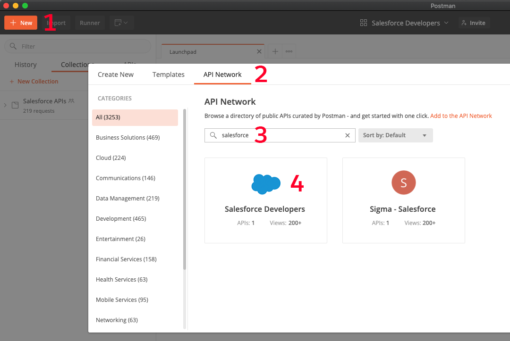
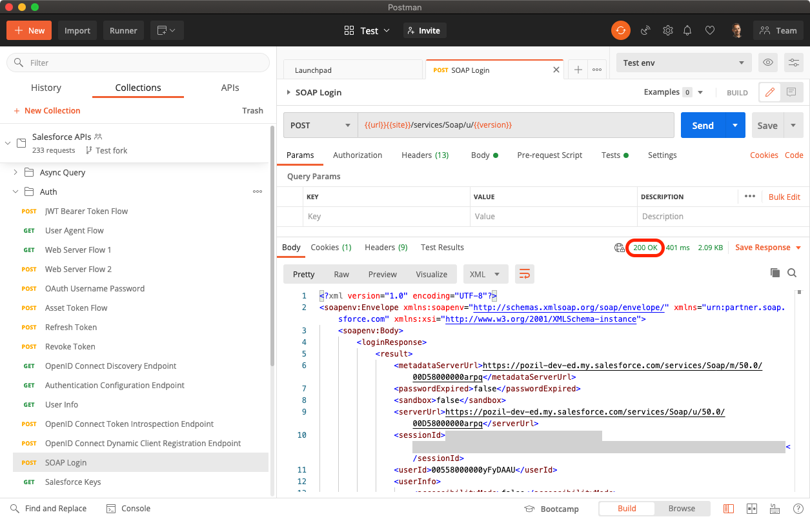

[Back to main page](README.md)

# Installing via the Postman API Network with the Desktop App

This is the recommended installation option because it is the fastest to set up and doesn’t require changes on your Salesforce org. You’ll import the collection from the Postman API Network.

## Install the Postman App

Download and install the Postman app from [this link](https://www.postman.com/downloads).

## Import the Salesforce APIs Collection

1. In the Postman desktop app, click the **New** button
1. Switch to the **API Network** tab
1. Search for **Salesforce**
1. Click **Salesforce Developers**
1. Click **Run in Postman** to import the collection.

## Configure the Salesforce APIs Collection

1. Click on the **Manage Environments** icon

    

1. Click on the **Duplicate Environment** icon next to the Salesforce Template Environment.

    

1. Click on **Salesforce Template Environment Copy**
1. Rename the environment with something meaningful in relation with your Salesforce org (e.g.: “Playground 1”).
1. Set values in the CURRENT VALUE column for the following variables:

    | Variable	| Current Value	|
    | ---	| ---	|
    | `url`	| Either: - `https://test.salesforce.com` for sandboxes or Scratch orgs. - `https://login.salesforce.com` for production, Trailhead Playground and Developer Edition orgs. - your custom My Domain URL.	|
    | `username`	| Your username	|
    | `password`	| Your password	|
    | `secretToken`	| Your personal [security token](https://help.salesforce.com/articleView?id=user_security_token.htm) (if required by your org)	|

1. Click **Update** and close the environments dialog.
1. Select your environment from the environment dropdown.

    

## Authenticate with Salesforce

1. Open the collection’s **Auth** folder and select the **SOAP Login** request
1. Click **Send**

At this point, if your environment is correctly set up, you should see a `200 OK` status. This means that you have successfully authenticated with Salesforce and that you can now use the other collection’s requests.

[Back to main page](README.md)
