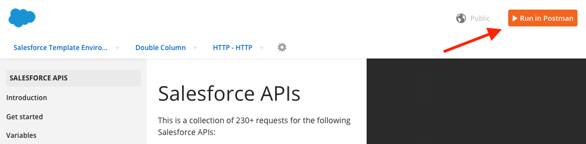
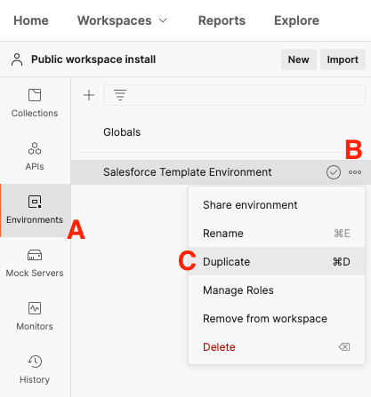
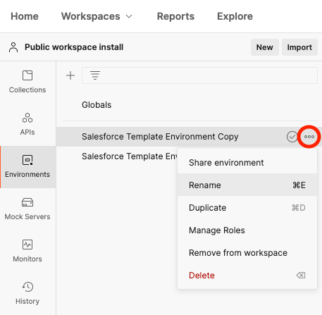
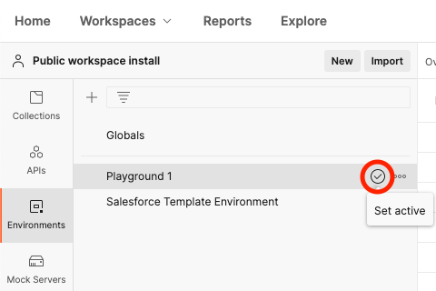
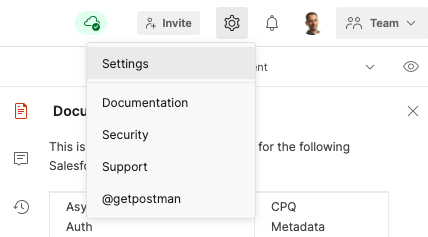
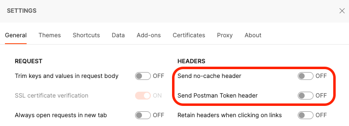
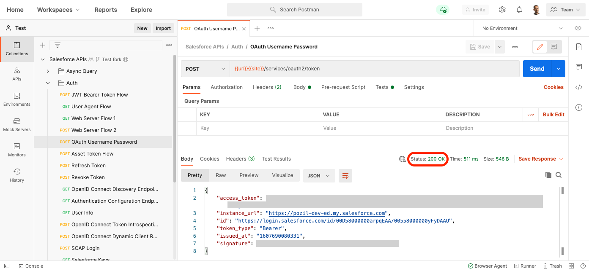

[Back to main page](README.md)

# Installing via the Postman API Network with the Web UI

Consider this installation option if you can’t install the Postman desktop app. This process require that you configure your Salesforce org to create a Connected App and set some CORS settings.


## Create a Connected App

1. Log in to your Salesforce org and navigate to **Setup**.
1. From Setup, enter `App Manager` in the Quick Find and select **App Manager**.
1. Click **New Connected App**.
1. Enter `Postman API Collection` as the Connected App Name.
1. Fill the Contact Email with your email.
1. Under the “API (Enable OAuth Settings)” section, check **Enable OAuth Settings**.
1. Enter the following text as the Callback URL (keep the line break):

    ```
    https://oauth.pstmn.io/v1/browser-callback
    https://oauth.pstmn.io/v1/callback
    ```

1. Under Selected OAuth Scope, move **Access and manage your data (API)** to the Selected OAuth Scopes list.
1. Click **Save**.
1. From this screen, copy the connected app’s **Consumer Key** and **Consumer Secret** some place temporarily. We’ll need those values to configure Postman.


## Enable CORS

1. In Setup, enter `CORS` in the Quick Find and select **CORS**.
1. Click **New** under Allowed Origins List
1. Enter `https://*.`[`postman.com`](http://postman.com/) as the **Origin URL Pattern**
1. Click **Save**
1. Repeat the previous steps and add `https://*.postman.co` (note the `.co` domain extension)
1. Click **Edit** under Cross-Origin Resource Sharing (CORS) Policy Settings
1. Check **Enable CORS for OAuth endpoints**
1. Click **Save**


## Import the Salesforce APIs Collection

1. Using a browser, [sign up/in to Postman](https://identity.getpostman.com/login)
1. Open [this link](https://documenter.getpostman.com/view/12721794/TVmFjfuh)
1. Click **Run in Postman**

    

1. Click **Postman for Web**
1. Select a workspace (the default “My Workspace” workspace is fine)


## Configure the Salesforce APIs Collection

1. In your Salesforce org Setup, enter `My Domain` in the Quick Find and select **My Domain**.
1. If your org does not have a My Domain, follow [these steps](https://help.salesforce.com/articleView?id=domain_name_setup.htm&type=5) to configure it.
1. Copy the value of Current My Domain URL (e.g: [`pozil-dev-ed.my.salesforce.com`](http://pozil-dev-ed.my.salesforce.com/))
1. In Postman, select the **Environments** tab (item A in following screenshot)
1. Click on the “three dots” icon next to the “Salesforce Environment Template” (B)
1. Select **Duplicate** from the menu (C)

    

1. Click **Salesforce Environment Template Copy**.
1. Click on the “three dots” icon next to the “Salesforce Environment Template Copy” and select **Rename** from the menu.

    

1. Rename the environment with something meaningful in relation with your Salesforce org (e.g.: “Playground 1”). Hit **Enter** to save your changes.
1. Set values in the CURRENT VALUE column for the following variables:

    | Variable | Current Value	|
    | ---	| ---	|
    | `url`	| Your domain URL with `https://`  in front of it (e.g: `https://pozil-dev-ed.my.salesforce.com`)	|
    | `username`	| Your username	|
    | `password`	| Your password	|
    | `secretToken`	| Your personal [security token](https://help.salesforce.com/articleView?id=user_security_token.htm)	|
    | `clientId`	| The Connected App consumer key that you've obtained after creating the connected app in your Salesforce Org	|
    | `clientSecret`	| The Connected App consumer secret that you've obtained after creating the connected app in your Salesforce Org	|

1. Click **Save**
1. Activate your environment by hovering over its name and clicking on the check icon.

    


## Configure Postman

We need to disable certain extra headers sent by Postman to prevent CORS issues.

1. Open Postman settings

    

1. Uncheck **Send no-cache header**
1. Uncheck **Send Postman Token header**

    

1. Close settings


## Authenticate with Salesforce

1. Select the **Collections** tab
1. Select the **Salesforce APIs** collection
1. Open the collection’s **Auth** folder and select the **OAuth Username Password** request
1. Click **Send**

At this point, if your environment is correctly set up, you should see a `200 OK` status. This means that you have successfully authenticated with Salesforce and that you can now use the other collection’s requests.



[Back to main page](README.md)
