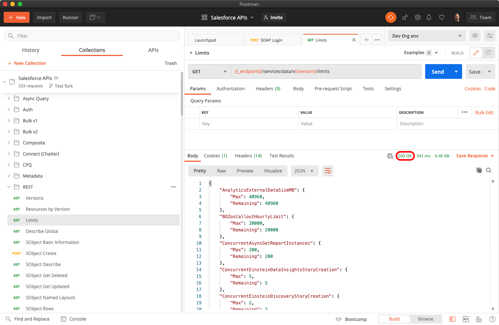

[Back to main page](README.md)

> Instructions updated for Postman desktop app v8

# Installing with the Postman Desktop App

This is the recommended installation option because it is the fastest to set up and doesn’t require changes on your Salesforce org.

🎥 [Video instructions](https://youtu.be/W-IwW6RM4F0)

- [Install the Postman App](#install-the-postman-app)
- [Fork the Collection](#fork-the-collection)
- [Configure the Collection](#configure-the-collection)
- [Authenticate with Salesforce](#authenticate-with-salesforce)
- [Execute a Request](#execute-a-request)

## Install the Postman App

Download and install the Postman app from [this link](https://www.postman.com/downloads).

### Fork the Collection

1. In the Postman desktop app, click on the top search bar and type **Salesforce**.
1. Click **Salesforce Developers** under Teams.

    

1. Click the **Salesforce APIs** tile.
1. Click **Fork**

    

1. Enter a label for your fork (e.g.: “My fork”).
1. Select a workspace (the default “My Workspace” workspace is fine).
1. Click **Fork Collection**.

## Configure the Collection

1. Click **Salesforce APIs**
1. Open the **Variables** tab.
1. If needed, update the `CURRENT VALUE` of the `url` variable with either:

    - `https://test.salesforce.com` for sandboxes or Scratch orgs.
    - `https://login.salesforce.com` for production, Trailhead Playground and Developer Edition orgs.
    - your custom My Domain URL.

1. Click **Save**.

## Authenticate with Salesforce

You'll need to authenticate with Salesforce to access the APIs. Doing so grants you an access token that is valid for a certain duration.

Repeat this step whenever your access token expires.

1. Click **Salesforce APIs**
1. Open the **Authorization** tab. The authorization type should be set to OAuth 2.0.
1. Click **Get New Access Token**. This opens a browser tab with the Salesforce login screen.
1. Log in to your Salesforce org.
1. Click **Allow** to grant access to "Salesforce APIs Collection for Postman" to your org.

    

    At this point, if your environment is correctly set up, you should see a success message and you should be redirected to the Postman app.

    If the redirection doesn't happen, you may need to authorize popups in your browser.

    

Click here for instructions on how to authorize popups.

    

    Note: these instructions are for Chrome but the steps should be similar with other browsers.

    1. Click the popup error in the address bar, choose to allow popups from Postman:

        

    1. Refresh the page and allow the browser to open the Postman app:

        
    

    

1. Copy the value of the `instance_url` field from the token details view. Make sure not to copy the line break character.

    

1. Click **Use Token**.
1. Open the **Variables** tab.
1. Update the `CURRENT VALUE` of the `_endpoint` variable with the value that you just copied from the `instance_url` field in the access token details.
1. Click **Save**.

## Execute a Request

1. Expand the collection and select the `REST > Limits` request.
1. Click `Send`.

At this point, if your environment is correctly set up, you should see a `200 OK` status. This means that you have successfully authenticated with Salesforce and that you can now use the other collection’s requests.

See [additional documentation](README.md#additional-documentation) for more information on how to keep the collection up to date and work with multiple Salesforce orgs.

[Back to main page](README.md)
