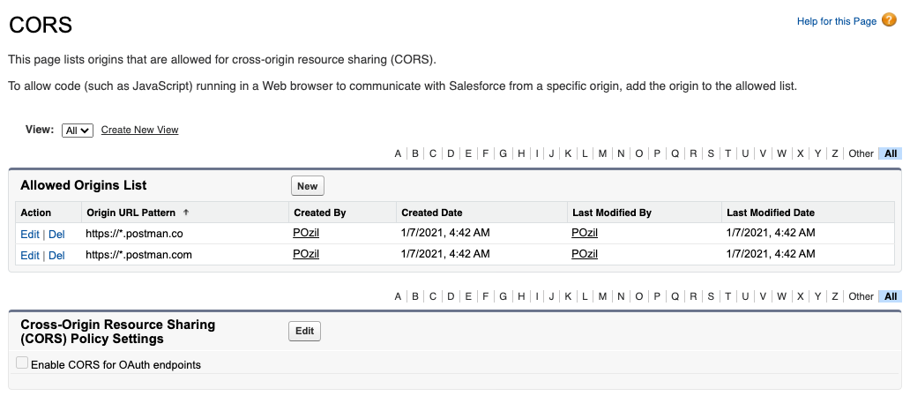

[Back to main page](README.md)

# Installing with the Postman Web UI

Consider this installation option if you can’t install the Postman desktop app.

🎥 [Video instructions](https://youtu.be/lxRNs4LsVdo)

- [Fork the Collection](#fork-the-collection)
- [Configure the Collection](#configure-the-collection)
- [Enable CORS in Salesforce](#enable-cors-in-salesforce)
- [Authenticate with Salesforce](#authenticate-with-salesforce)
- [Execute a Request](#execute-a-request)

## Fork the Collection

1. Click this button:

    [](https://app.getpostman.com/run-collection/12721794-67cb9baa-e0da-4986-957e-88d8734647e2?action=collection%2Ffork&collection-url=entityId%3D12721794-67cb9baa-e0da-4986-957e-88d8734647e2%26entityType%3Dcollection%26workspaceId%3D34382471-0c97-40e5-a206-f947271665c4#?env%5BSalesforce%20APIs%20Template%20Environment%5D=W3sia2V5IjoidXJsIiwidmFsdWUiOiJodHRwczovL3Rlc3Quc2FsZXNmb3JjZS5jb20iLCJlbmFibGVkIjp0cnVlfSx7ImtleSI6InZlcnNpb24iLCJ2YWx1ZSI6IjUzLjAiLCJlbmFibGVkIjp0cnVlfSx7ImtleSI6InVzZXJuYW1lIiwidmFsdWUiOiIiLCJlbmFibGVkIjp0cnVlfSx7ImtleSI6InBhc3N3b3JkIiwidmFsdWUiOiIiLCJlbmFibGVkIjp0cnVlfSx7ImtleSI6InNlY3JldFRva2VuIiwidmFsdWUiOiIiLCJlbmFibGVkIjp0cnVlfSx7ImtleSI6ImNsaWVudElkIiwidmFsdWUiOiIzTVZHOThfUHNnNWNwcHlZQ21rMWdaTkMyNW8wMFNYcGdwb2RsUzI5SVo2cFhpSGt0M3h1UGE1cUlqQlR0RWdkc2lNdUlXVk5fOEYwam53RXRiRGg0IiwiZW5hYmxlZCI6dHJ1ZX0seyJrZXkiOiJjbGllbnRTZWNyZXQiLCJ2YWx1ZSI6IiIsImVuYWJsZWQiOnRydWV9LHsia2V5IjoicmVkaXJlY3RVcmwiLCJ2YWx1ZSI6IiIsImVuYWJsZWQiOnRydWV9LHsia2V5IjoiaW5pdEFjY2Vzc1Rva2VuIiwidmFsdWUiOiIiLCJlbmFibGVkIjp0cnVlfSx7ImtleSI6InNpdGUiLCJ2YWx1ZSI6IiIsImVuYWJsZWQiOnRydWV9XQ==)

1. Click **Fork Collection**.
1. [Sign up/in to Postman](https://identity.getpostman.com/login).
1. Enter a label for your fork (e.g.: “My fork”).
1. Select a workspace (the default “My Workspace” workspace is fine).
1. Click **Fork Collection**.

## Configure the Collection

1. Click **Salesforce APIs**
1. Open the **Variables** tab.
1. If needed, update the `CURRENT VALUE` of the `url` variable with your org's My Domain login URL in one of these formats:

    - `https://MyDomainName--SandboxName.sandbox.my.salesforce.com` for sandboxes or Scratch orgs.
    - `https://MyDomainName.my.salesforce.com` for production, Trailhead Playground and Developer Edition orgs.

1. Click **Save**.

## Enable CORS in Salesforce

1. In Salesforce Setup, enter `CORS` in the Quick Find and select **CORS**.
1. Click **New** under Allowed Origins List
1. Enter `https://*.postman.com` as the **Origin URL Pattern**
1. Click **Save**
1. Repeat the previous steps and add `https://*.postman.co` (note the `.co` domain extension)

## Authenticate with Salesforce

You'll need to authenticate with Salesforce to access the APIs. Doing so grants you an access token that is valid for a certain duration.

Repeat this step whenever your access token expires.

1. Click **Salesforce APIs**
1. Open the **Authorization** tab. The authorization type should be set to OAuth 2.0.
1. Click **Get New Access Token**. This opens a browser tab with the Salesforce login screen.
1. Log in to your Salesforce org.
1. Click **Allow** to grant access to "Salesforce APIs Collection for Postman" to your org.

    

    At this point, if your environment is correctly set up, you should see a success message and you should be redirected to the Postman web UI.

1. Copy the value of the `instance_url` field from the token details view. Make sure not to copy the line break character.

    

1. Click **Use Token**.
1. Open the **Variables** tab.
1. Update the `CURRENT VALUE` of the `_endpoint` variable with the value that you just copied from the `instance_url` field in the access token details.
1. Click **Save**.

## Execute a Request

1. Expand the collection and select the `REST > Limits` request.
1. Click `Send`.

At this point, if your environment is correctly set up, you should see a `200 OK` status. This means that you have successfully authenticated with Salesforce and that you can now use the other collection’s requests.

See [additional documentation](README.md#additional-documentation) for more information on how to keep the collection up to date and work with multiple Salesforce orgs.

[Back to main page](README.md)
