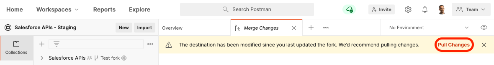

[Back to main page](README.md)

# Updating the collection

You can keep your copy of the collection up to date to benefit from new API requests and bug fixes by pulling changes from the main collection without having to reimport anything.

## Pull Changes

1. Using a browser, [sign up/in to Postman](https://identity.getpostman.com/login).
1. Navigate to the workspace that holds your collection.
1. Click on the “three dots” icon next to the “Salesforce APIs” collection and select **Merge Changes** from the menu.

    

1. If the main collection has changes, you'll see a yellow banner with a **Pull Changes** link. Click the link.

    

1. Review the changes and click **Pull Changes**.

[Back to main page](README.md)
