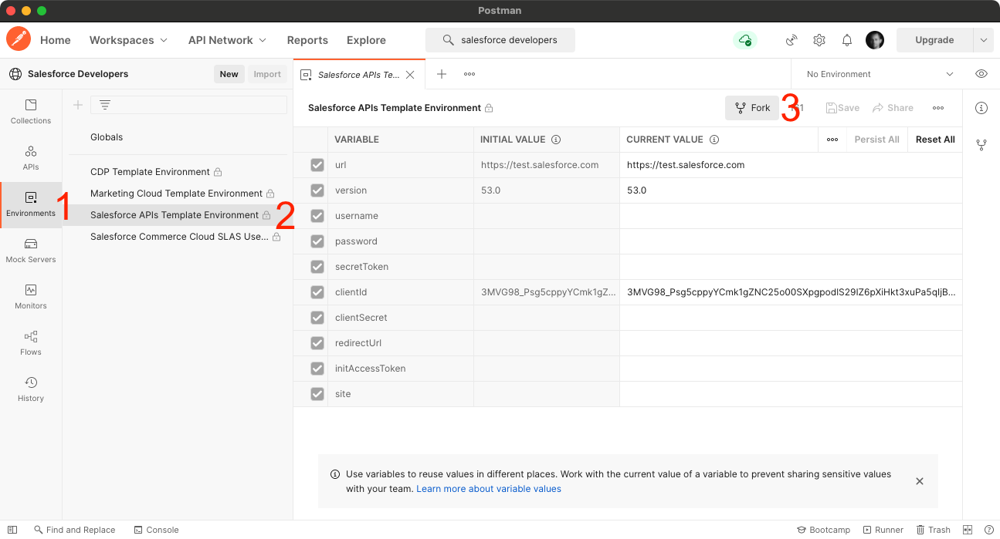
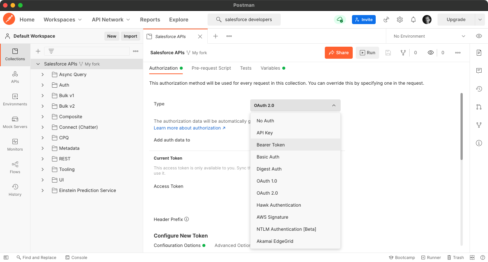

[Back to main page](README.md)

# Working with environments to connect to multiple Salesforce orgs

You can use Postman environments to work with multiple Salesforce orgs in parallel.

> ⚠️ Using environments means that you will store Salesforce credentials in clear in Postman. Do this at your own risks.

- [Import the Template Environment](#import-the-template-environment)
- [Configure the Environment](#configure-the-environment)
- [Change the Collection Authorization Type](#change-the-collection-authorization-type)
- [Authenticate with Salesforce](#authenticate-with-salesforce)

## Import the Template Environment

1. Open the master collection from the Salesforce Developers workspace with [this link](https://www.postman.com/salesforce-developers/workspace/salesforce-developers) or using Postman's search bar.
1. Fork the **Salesforce APIs Environment Template** environment:
    1. Select the **Environments** tab.
    1. Click **Salesforce APIs Environment Template**.
    1. Click **Fork**.

    

    1. Enter a label for your fork (e.g.: “My fork”).
    1. Select the workspace that contains your working copy of the collection.
    1. Click **Fork Environment**.

## Configure the Environment

1. Click on the “three dots” icon on the right and select **Duplicate** from the menu.

    

    This creates a `Salesforce Environment Template Copy` template.

1. Click **Salesforce APIs Environment Template Copy**.
1. Rename the environment with something meaningful in relation with your Salesforce org (e.g.: “Playground 1”).
1. Set values in the CURRENT VALUE column for the following variables:

    | Variable	| Current Value	|
    | ---	| ---	|
    | `url`	| Either: - `https://MyDomainName--SandboxName.sandbox.my.salesforce.com` for sandboxes or Scratch orgs. - `https://MyDomainName.my.salesforce.com` for production, Trailhead Playground and Developer Edition orgs.	|
    | `username`	| Your username	|
    | `password`	| Your password	|
    | `secretToken`	| Your personal [security token](https://help.salesforce.com/articleView?id=user_security_token.htm) (if required by your org)	|

1. Click **Save**.
1. Select your environment from the environment dropdown.

    

## Change the Collection Authorization Type

1. Navigate to the **Collections** tab and select your collection.
1. In the **Authorization** tab, select **Bearer Token** as the authorization type.

    

1. Enter `{{_accessToken}}` for the Token value.
1. Click **Save**

## Authenticate with Salesforce

1. Open the collection’s **Auth** folder and select the **SOAP Login** request
1. Click **Send**

At this point, if your environment is correctly set up, you should see a `200 OK` status. This means that you have successfully authenticated with Salesforce and that you can now use the other collection’s requests.

[Back to main page](README.md)
